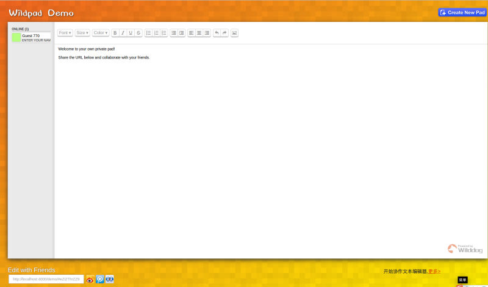

# demo-js-wildpad
[Wildpad](http://wildpad.wilddogapp.com/)是一个开源的协同文本编辑器，它可以嵌入到较大的应用中.

## 在线示例

可以参考[wilddog demo](http://wildpad.wilddogapp.com/demo) 

[](http://wildpad.wilddogapp.com/demo/)

## 在线文档

[Wildpad在线文档](http://wildpad.wilddogapp.com/docs/)

## 下载
Wildpad 使用 [Wilddog](https://www.wilddog.com)提供后端服务，因此它不需要后端的支持，只需要引入少量的
js文件，就可以把它嵌入到你的应用中。

```HTML
<!-- Wilddog -->
<script src='https://cdn.wilddog.com/js/client/current/wilddog.js'></script>

<!-- CodeMirror -->
<script src="https://cdnjs.cloudflare.com/ajax/libs/codemirror/5.2.0/codemirror.js"></script>
<link rel="stylesheet" href="https://cdnjs.cloudflare.com/ajax/libs/codemirror/5.2.0/codemirror.css"/>

<!-- Wildpad -->
<link rel="stylesheet" href="https://cdn.wilddog.com/app/wildpad/0.1/wildpad.css" />
<script src="https://cdn.wilddog.com/app/wildpad/0.1/wildpad.js"></script>
```

## 示例代码
```HTML
<div id="wildpad"></div>
<script>
  var wildpadRef = new Wilddog('<WILDDOG URL>');
  var codeMirror = CodeMirror(document.getElementById('wildpad'), { lineWrapping: true });
  var wildpad = Wildpad.fromCodeMirror(wildpadRef, codeMirror,
      { richTextShortcuts: true, richTextToolbar: true, defaultText: 'Hello, World!' });
</script>
```
野狗支持使用 [CodeMirror](http://codemirror.net/)和[ACE](http://ace.c9.io/)作为基础编辑器，可以参考
[wildpad文档](http://wildpad.wilddogapp.com/docs)。

## 本地运行

首先确认本机已经安装 [Node.js](http://nodejs.org/) 运行环境，然后执行下列指令：

```
git clone git@github.com:WildDogTeam/demo-js-wildpad.git
cd  demo-js-wildpad
```

安装依赖：
```
npm install bower -g
npm install
bower install
```

启动项目：

```
grunt
```

你也可以通过npm 或者 bowr安装Wildchat, 他们会自动下载依赖。


```bash
$ bower install wildpad --save
```
* `dist/` - grunt文件合并路径 (`wildpad.js`, `wildpad.min.js`, `wildpad.css`, `wildpad.eot`).
* `examples/` - 一些嵌入Wildpad的例子.
* `font/` - 工具栏的图标和字体.
* `lib/`
    * `wildpad.js` 
    * `text-operation.js`, `client.js`
    * `annotation-list.js`
    * `rich-text-codemirror.js`
    * `wilddog-adapter.js` 

## 生成本地文档
**本地文档是用jekyll构建的，jekyll需要ruby环境的运行环境。如果没有ruby环境，可以查看上面的在线文档。**

```
cd website/
```

生成web部署文件：

```
jekyll build
```

本地运行
```
jekyll serve --watch
```

你可以访问http://localhost:4000/预览

发布生成html文件，可以运行
    ./deploy.sh

## 入门

Wildpad使用野狗数据库，你可以从这里
[注册](https://www.wilddog.com/my-account/signup)一个免费体验账号。

## 更多示例

这里分类汇总了 WildDog平台上的示例程序和开源应用，　链接地址：[https://github.com/WildDogTeam/wilddog-demos](https://github.com/WildDogTeam/wilddog-demos)

## 支持
如果在使用过程中有任何问题，请提 [issue](https://github.com/WildDogTeam/demo-js-wildpad/issues) ，我会在 Github 上给予帮助。

## 相关文档

* [Wilddog 概览](https://z.wilddog.com/overview/introduction)
* [JavaScript SDK快速入门](https://z.wilddog.com/web/quickstart)
* [JavaScript SDK API](https://z.wilddog.com/web/api)
* [下载页面](https://www.wilddog.com/download/)
* [Wilddog FAQ](https://z.wilddog.com/questions)
* [jekyll 中文](http://jekyll.bootcss.com/docs/home/) 开源软件，功能是将纯文本转化为静态网站和博客
* [jekyll 中文安装文档](http://jekyll.bootcss.com/docs/installation/)

## License
MIT
http://wilddog.mit-license.org/

## 感谢 Thanks

We would like to thank the following projects for helping us achieve our goals:

Open Source:

* [firepad](https://github.com/firebase/firepad) Firepad is an open-source, collaborative code and text editor. It is designed to be embedded inside larger web applications.
* [jquery](http://jquery.com/) The Write Less, Do More, JavaScript Library
* [codemirror](https://codemirror.net/)　CodeMirror is a versatile text editor implemented in JavaScript for the browser.
* [ace](http://ace.c9.io/) Ace is an embeddable code editor written in JavaScript.


